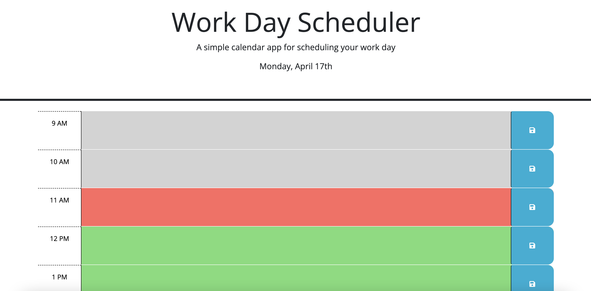

# 05 Third-Party APIs: Work Day Scheduler

## Task

The task of this week was to work with a given code and create a dynamic calendar application that allows a user to save events for each hour of the day. The challange was to store user input in local storage, display the tasks in the corresponding hour block and add color to the time-blocks according to the actual hour. 

## User Story

```md
AS AN employee with a busy schedule
I WANT to add important events to a daily planner
SO THAT I can manage my time effectively
```

## Acceptance Criteria

```md
GIVEN I am using a daily planner to create a schedule
WHEN I open the planner
THEN the current day is displayed at the top of the calendar
WHEN I scroll down
THEN I am presented with timeblocks for standard business hours
WHEN I view the timeblocks for that day
THEN each timeblock is color coded to indicate whether it is in the past, present, or future
WHEN I click into a timeblock
THEN I can enter an event
WHEN I click the save button for that timeblock
THEN the text for that event is saved in local storage
WHEN I refresh the page
THEN the saved events persist
```

The following mockups demonstrates the application functionality:

Different color time-blocks depending the day time: 


Information stored in local storage and displayed in corresponding time-block: 


## Deployed Application

Link to deployed application: https://mariafernandamarroquin.github.io/work-day-scheduler/

- - -
© 2023 edX Boot Camps LLC. Confidential and Proprietary. All Rights Reserved.
